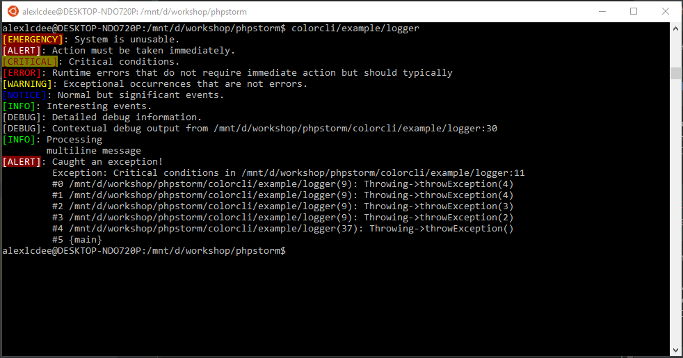
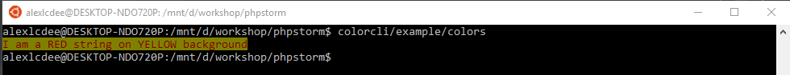

# Color CLI

PHP library for rendering colored CLI messages. 

## Usage

#### Installation
```
composer require alexlcdee/colorcli
```

### Logger
Logger class is a PSR-3 compatible logger. Provides colored log level tags.

Colors can be customised with 
```php 
setBGColor($level, BackgroundColors $bgcolor = null)
``` 
and 
```php
setFGColor($level, ForegroundColors $fgcolor = null)
```
By default, Logger passes error-like messages to STDERR and info-like messages to STDOUT.
This behavior can be also customised with
```php
setOutputStream($level, resource $stream)
```

Logger has support of context param and placeholders in message.
```php
$logger->debug('Debug output from {fileName}:{line}', [
    'fileName' => __FILE__, 
    'line' => __LINE__
]);
```
Context key 'exception' accepts instance of Exception and renders exception name with
message, filename, line and stacktrace right after logged message.
```php
// catch an exception and pass it to log as context param
try {
    // your code here
} catch (Exception $e) {
    $logger->alert("I've caught an exception", ['exception' => $e]);
}
```

Messages with newlines will be padded with empty string with length of level tag.

#### Usage
```php
require_once dirname(__DIR__) . '/vendor/autoload.php';

$logger = new \ColorCLI\Logger();

$logger->emergency('System is unusable.');
$logger->alert('Action must be taken immediately.');
$logger->critical('Critical conditions.');
$logger->error('Runtime errors that do not require immediate action but should typically');
$logger->warning('Exceptional occurrences that are not errors.');
$logger->notice('Normal but significant events.');
$logger->info('Interesting events.');
$logger->debug('Detailed debug information.');

$logger->debug('Contextual debug output from {fileName}:{line}', [
    'fileName' => __FILE__,
    'line' => __LINE__
]);

$logger->info("Processing
multiline message");

try {
    (new Throwing())->throwException();
} catch (Exception $e) {
    $logger->alert('Caught an exception!', ['exception' => $e]);
}
```
The example above provides the following output:



### ColorHelper
Provides static method to color input string

#### Usage
```php
// Print string with red font on yellow background
echo ColorHelper::colorString('I am a RED string on YELLOW background', ForegroundColors::RED(), BackgroundColors::YELLOW());
echo PHP_EOL;
```
The example above provides the following output: 


### BackgroundColors and ForegroundColors
These classes are simply MyCLabs\Enum\Enum classes and provides supported colors lists. 
[Read more](https://github.com/myclabs/php-enum/blob/master/README.md) about MyCLabs\Enum

# Credits
ColorHelper idea was taken from article 
[PHP CLI Colors – PHP Class Command Line Colors (bash)](https://www.if-not-true-then-false.com/2010/php-class-for-coloring-php-command-line-cli-scripts-output-php-output-colorizing-using-bash-shell-colors/)
